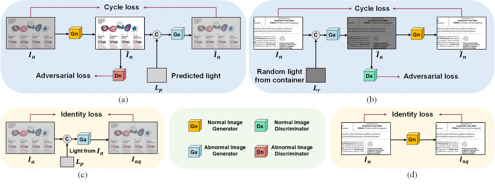

# UDoc-GAN

> Official PyTorch implementation for ACM MM22 "UDoc-GAN: Unpaired Document Illumination Correction with Background Light Prior"



## Prerequisites

* linux or macos
* python 3.6
* pytorch 1.8

## Datasets

#### DocProj Datasets

Original DocProj Datasets has either geometric correction or illumination correction. [Original DocProj](https://github.com/xiaoyu258/DocProj) (You do not need to download this dataset.)

For LPNet, it is trained on the DocProj Datasets which has been geometrically corrected and cropped into uniform illumination patches. You can download the datasets directly from [Baidu Disk](https://pan.baidu.com/s/12n7q0g_CkGoUHe_Juff46w) Code: `df98`

For UDoc-GAN, it is trained on the DocProj Datasets which has been geometrically corrected. You can download the datasets directly from [Baidu Disk](https://pan.baidu.com/s/1yetkBQvTq4tU4cNIYGLw4w) Code: `df98`

## Get Started

### Training

For LPNet: 

```Python
python -m torch.distributed.launch --nproc_per_node=1 --master_port=your_port --data_dir=your_lpnet_data_dir LPNet.py
```

For UDoc-GAN: 

```python
python -m torch.distributed.launch --nproc_per_node=1 --master_port=your_port --data_dir=your_udoc_data_dir UDoc_GAN.py
```

### Testing

You can test one epoch or more epochs by using `testone.py` or `testauto.py`

for example, test one epoch: 

```python
python testone.py --dataroot=your_data_root
```

**inference**

We use window 10 for our inference environments. You also need to install

* python 3.8
* pytesseract 0.3.9
* Tesseract-OCR v5.0.1

and then run

```python
python evaluation.py
```

### Pre-Trained Models

The original model is deleted by mistake, we retrain the model and obtain the latest model.

doctr: [model](https://pan.baidu.com/s/1wdvyXEUWnZvFBkuGZwP2PQ) [results](https://pan.baidu.com/s/1XdWXSoE7ukcWNPPawzuiQA) Code: `df98`

dewarpnet: [model](https://pan.baidu.com/s/1hQFeAs-cDmwbw2qMBE09Dg) [results](https://pan.baidu.com/s/1dlbE_yo94_AlvavPf00fjQ) Code: `df98`

|           | Paper(ED/CER) | Pre-Train(ED/CER) |
| --------- | ------------- | ----------------- |
| DocTr     | 396.17/0.12   | 406.76/0.13       |
| DewarpNet | 558.61/0.18   | 558.11/0.18       |

original paper results: [doctr](https://pan.baidu.com/s/1rgweBKhvUrRKQeX6uJg3TA), [dewarpnet](https://pan.baidu.com/s/1KhS3VD9UhtGL_ide5zSPhQ) Code: `df98`

**NOTE: In the original [DocUNet Benchmark](https://www3.cs.stonybrook.edu/~cvl/docunet.html). The '64_1.png' and '64_2.png' distorted images are rotated by 180 degrees. Nearly all previous works ignore this problems and we also don't find this issue. We hope future work can rectify it. For more information, you can refer to [DocTr](https://github.com/fh2019ustc/DocTr)**


## Citations

coming soon